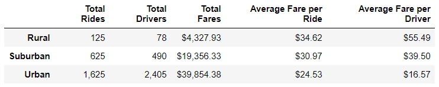
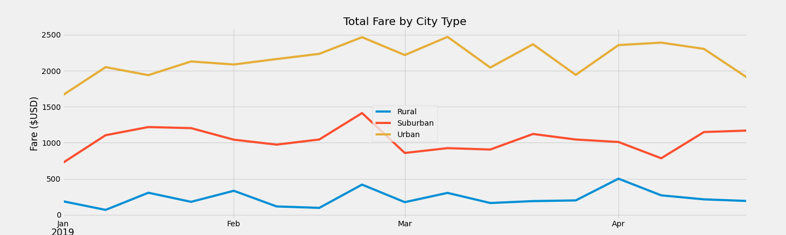

# PyBer Analysis Report

## Background and Results

### Purpose
  - The purpose of this project was to create visualizations that illustrate key metrics for PyBer ride-sharing data by city type.

### Technical Analysis
  - The ride share data was analyzed to find the total rides, total drivers, total fares, average fare per ride, and average fare per driver for each city type: rural, suburban, and urban.

### Results
  - The following DataFrame shows that total rides, total drivers, and therefore, total fares in rural city types is less than that of suburban which is less than that of urban city types.  It can also be seen that the average fare per ride and average fare per driver take on an inverse relationship to the number of rides and drivers. 
---

---
  - The following graph shows the total fare by city type for January, February, March, and April of 2019.  It can be seen that the most revenue is generated from urban cities followed by suburban cities and rural cities.
---

---
### Summary
  - Illustrated above, more fare revenue is generated per ride for rural cities where rides are less frequent but longer rides.  Moving to suburban and urban cities increases, respectively, the number of rides, however, the length of each ride also decreases, respectively.  Shown in the second graph, however, most revenue is generated from the shorter, more frequent rides of the urban cities, followed by the suburban cities and rural cities.

## Challenges Encountered and Overcome

### Challenges and Difficulties Encountered

* Programming
  - Pivoting the data on city type proved to be most challenging from a programming standpoint.  Once I found the pd.pivot_table() function, the task became quite simple.
  
* Data analysis
  - Calculating the total drivers by city type was unexpectedly challenging.  In pulling data from the pyber_data_df DataFrame, I was getting the same output for driver count as I was for total rides.  I had determined the .sum() method was adding the number of drivers each time a ride was recorded for each city.  We only needed to sum the drivers once for each city.  I realized pulling data from the city_data_df DataFrame would yield the correct information.

* Graphing, etc
  - Formatting the DataFrame to include thousands place commas and dollar signs was a challenge.  Additionally, formatting the "Total Fare by City Type" graph to include the appropriate x-tick markers and left justifying the x-axis label proved challenging.

### Technical Analyses Used
  - In most every instance, finding Matplotlib documentation, Pandas documentation, or information on Stack Overflow solved the issue.  I used .groupby(), .count(), and .sum() to find data and perform calculations.  I used the pd.pivot_table() function to see the data more clearly.  I also used .loc() and .resample() to put data in bins to create a FiveThirtyEight style graph.

## Recommendations and Next Steps
  - To address disparities among city types it might be useful to analyze data incorporating population of city and ride length.

### Recommendations for Future Analysis

### Additional Analysis 1

* The city population analysis would show if trends are similar in more populous cities versus less populous cites in each city type category.  This might help to determine if there are other factors influencing the trends seen above.

* Cities would be ranked in order of population per city type and plotted against fare per ride.  A bubble plot showing data for each city in each city type by fare per ride would be used.

### Additional Analysis 2

* The ride length analysis would help to determine how influential distance per ride is on total fare.  This too will help determine if there are other factors influencing the trends above.

* Fare per ride data could be plotted against distance per ride data to show trends to determine the role of distance on price per ride.
